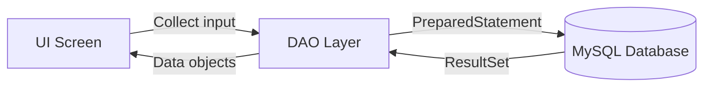

# Process Guide - Naval Blood Donation Archive System

This document explains, in detail, how each screen works and how CRUD operations flow through the system. It is designed for understanding the full program process end-to-end.

## 1) Login Screen (`LoginFrame`)
**Purpose:** Authenticate staff before granting access.

**Process Flow:**
1. Staff enters **Username** and **Password**.
2. On **Login** button click:
   - UI calls `AdminDAO.validateLogin(username, password)`.
   - DAO checks `admin_table` using a `PreparedStatement`.
3. If credentials are valid:
   - `DashboardFrame` opens.
   - Login window closes.
4. If invalid:
   - Error dialog appears.

**CRUD Reference:**
- **Read**: Query `admin_table` for a matching user.

---

## 2) Dashboard Screen (`DashboardFrame`)
**Purpose:** Provide a hospital overview summary and quick access to modules.

**Process Flow:**
1. On window creation, `refreshDashboard()` runs.
2. It loads:
   - **Total Donors** → `DonorDAO.getAllDonors()`
   - **Total Blood Units** → `BloodUnitDAO.getTotalUnitsCount()`
   - **Available Units** → `BloodUnitDAO.getAvailableUnitsCount()`
   - **Recent Donations (Table)** → `TransactionDAO.getRecentTransactions(5)`
3. Buttons allow navigation:
   - **Donor Management** → `DonorListFrame`
   - **Record Donation** → `DonationForm`
   - **Blood Inventory** → `InventoryFrame`
   - **Reports** → `ReportFrame`

**CRUD Reference:**
- **Read**: Fetch donor counts, unit counts, and recent transactions.

---

## 3) Donor Management List (`DonorListFrame`)
**Purpose:** Manage donor records (CRUD).

**Process Flow:**
1. Screen loads and calls `loadDonors("")`.
2. This populates the JTable from `DonorDAO.getAllDonors()`.

### Actions
**Search**
- User enters keyword and clicks **Search**.
- Calls `DonorDAO.searchDonors(keyword)`.
- Filters by `first_name`, `last_name`, or `blood_type`.

**Add Donor**
- Opens `DonorForm` in create mode.

**Edit Selected**
- Reads selected row’s `donor_id`.
- Calls `DonorDAO.getDonorById(id)`.
- Opens `DonorForm` in edit mode.

**Delete Selected**
- Reads selected row’s `donor_id`.
- Calls `DonorDAO.deleteDonor(id)`.
- Refreshes table.

**CRUD Reference:**
- **Create**: From `DonorForm`.
- **Read**: List/search.
- **Update**: Edit via form.
- **Delete**: Delete button.

---

## 4) Donor Form (`DonorForm`)
**Purpose:** Add or update a donor.

**Inputs:**
- First Name
- Last Name
- Blood Type (dropdown)
- Contact No
- Address
- Last Donation Date (date picker + optional “Not set”)
- Eligibility Status (dropdown)

### Create Flow
1. Staff fills form.
2. Clicks **Save**.
3. UI validates required fields.
4. DAO inserts donor:
   - `DonorDAO.addDonor(donor)` → `donor_table`.
5. Success dialog + form closes.

### Update Flow
1. Form preloads donor values.
2. Staff edits fields.
3. Clicks **Update**.
4. DAO updates donor:
   - `DonorDAO.updateDonor(donor)`.
5. Success dialog + form closes.

**CRUD Reference:**
- **Create**: Insert into `donor_table`.
- **Update**: Update existing donor.

---

## 5) Donation Form (`DonationForm`)
**Purpose:** Record a blood donation and automatically generate a blood unit + transaction.

**Inputs:**
- Donor (dropdown of all donors)
- Volume (ml)
- Collection Date (date picker)
- Expiry Date (date picker)
- Staff ID
- Remarks

**Process Flow:**
1. Staff selects a donor.
2. System checks donor eligibility:
   - If status is **Ineligible**, donation is blocked.
3. Staff fills donation data and clicks **Record Donation**.
4. The system:
   - Creates a **BloodUnit** → `BloodUnitDAO.addAndReturnId()`
   - Creates a **DonationTransaction** → `TransactionDAO.addTransaction()`
   - Updates donor status → `DonorDAO.updateDonationStatus(donorId, collectionDate, "Ineligible")`
5. Success dialog + form closes.

**CRUD Reference:**
- **Create**: Inserts in `blood_unit_table` and `donation_transaction_table`.
- **Update**: Sets donor eligibility to **Ineligible** after donation.

---

## 6) Inventory Screen (`InventoryFrame`)
**Purpose:** View and update blood unit status.

**Process Flow:**
1. Loads all blood units with `BloodUnitDAO.getAllUnits()`.
2. Displays them in a JTable.

### Update Status
1. Staff selects a row.
2. Chooses a new status (Available, Issued, Expired).
3. Clicks **Update Status**.
4. DAO updates record:
   - `BloodUnitDAO.updateStatus(unitId, status)`.
5. Table refreshes.

**CRUD Reference:**
- **Read**: Load all units.
- **Update**: Change status.

---

## 7) Reports Screen (`ReportFrame`)
**Purpose:** View and export reports.

**Tabs:**
- **Donor List** (from `donor_table`)
- **Inventory** (from `blood_unit_table`)
- **Donation History** (from `donation_transaction_table`)

**Process Flow:**
1. Each tab loads via DAO:
   - Donors → `DonorDAO.getAllDonors()`
   - Inventory → `BloodUnitDAO.getAllUnits()`
   - Transactions → `TransactionDAO.getAllTransactions()`

### Export CSV
- Exports currently active tab using `ReportExporter.exportTableToCSV()`.

### Export PDF
- Uses built-in print dialog; staff selects **Microsoft Print to PDF**.

**CRUD Reference:**
- **Read**: All reports are read-only by design.

---

## Data Integrity Notes
- Donors become **Ineligible** after donating (prevents immediate repeat donation).
- Blood units are tracked separately from donors for inventory control.
- Transactions preserve audit history; no delete/update exposed in UI.

---

## Summary of CRUD by Screen
- **Login:** Read admin credentials
- **Dashboard:** Read-only summary
- **Donor List / Donor Form:** Full CRUD on donors
- **Donation Form:** Create unit + transaction, update donor eligibility
- **Inventory:** Read units, update status
- **Reports:** Read-only + export

---

## Flow Diagrams

### Global MVC Flow (UI → DAO → Database)


### Login Flow
```mermaid
flowchart TD
    A[LoginFrame] --> B[Enter Username/Password]
    B --> C[AdminDAO.validateLogin()]
    C --> D{Valid?}
    D -->|Yes| E[Open DashboardFrame]
    D -->|No| F[Show Error Dialog]
```

### Donor CRUD Flow
```mermaid
flowchart TD
    A[DonorListFrame] --> B[Load Donor Table]
    B --> C[DonorDAO.getAllDonors()]
    A --> D[Add Donor]
    D --> E[DonorForm Save]
    E --> F[DonorDAO.addDonor()]
    A --> G[Edit Donor]
    G --> H[DonorDAO.getDonorById()]
    H --> I[DonorForm Update]
    I --> J[DonorDAO.updateDonor()]
    A --> K[Delete Donor]
    K --> L[DonorDAO.deleteDonor()]
```

### Donation Recording Flow
```mermaid
flowchart TD
    A[DonationForm] --> B[Select Donor]
    B --> C{Eligibility == Eligible?}
    C -->|No| D[Block Donation]
    C -->|Yes| E[Enter Donation Details]
    E --> F[BloodUnitDAO.addAndReturnId()]
    F --> G[TransactionDAO.addTransaction()]
    G --> H[DonorDAO.updateDonationStatus()]
    H --> I[Success Dialog]
```

### Inventory Status Update Flow
```mermaid
flowchart TD
    A[InventoryFrame] --> B[Load Units Table]
    B --> C[BloodUnitDAO.getAllUnits()]
    A --> D[Select Unit + New Status]
    D --> E[BloodUnitDAO.updateStatus()]
    E --> F[Refresh Table]
```

### Reports Export Flow
```mermaid
flowchart TD
    A[ReportFrame] --> B[Select Report Tab]
    B --> C[DAO Loads Data]
    A --> D[Export CSV]
    D --> E[ReportExporter.exportTableToCSV()]
    A --> F[Export PDF]
    F --> G[JTable.print() -> Print to PDF]
```
